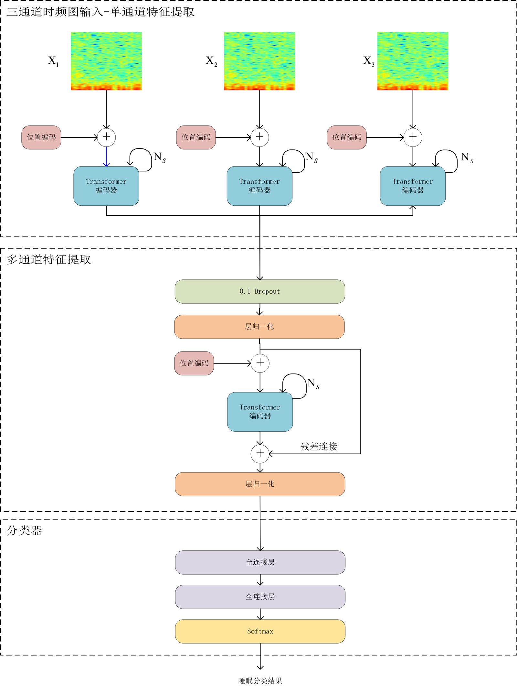
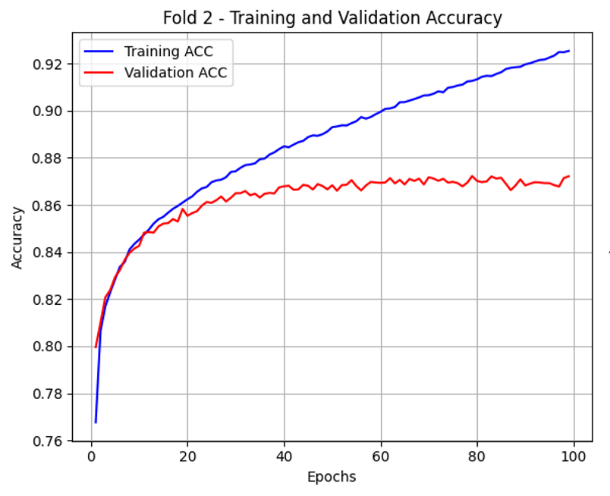

# TFJ-SSC

**Temporal-Frequency Joint Transformer for Sleep Stage Classification**
基于 Transformer 的脑电-眼电（EEG-EOG）多模态时频联合睡眠分期模型

Code for my undergraduate thesis *脑电-眼电信号融合的多模态睡眠阶段监测系统* (EEG-EOG Fusion-Based Multimodal Sleep Stage Monitoring System), School of Artificial Intelligence, Tiangong University, 2025.

This repository is a fork of [MultiChannelSleepNet](https://github.com/yangdai97/MultiChannelSleepNet) (Dai et al., IEEE JBHI 2023). TFJ-SSC keeps its overall design (per-channel Transformer feature extraction, then multi-channel fusion) and changes the training procedure and tooling; see [What changed](#what-changed-compared-with-multichannelsleepnet).



## Method (thesis model, `model.py`)

Each 30 s epoch of three PSG channels (EEG Fpz-Cz, EEG Pz-Oz, horizontal EOG) is turned into a time-frequency image with the STFT and z-score normalized per channel. TFJ-SSC then:

1. **Single-channel feature extraction**: adds a sinusoidal positional encoding to each channel's image and passes it through its own 12-layer Transformer encoder.
2. **Multi-channel feature fusion**: concatenates the three feature maps, applies layer normalization and positional encoding, and runs a 5-layer Transformer encoder. A residual connection keeps each channel's original features.
3. **Classifier**: two fully connected layers and softmax over the five AASM stages (W, N1, N2, N3, REM).

Training uses 5-fold stratified cross-validation, AdamW (weight decay 0.01), early stopping on validation macro-F1 (patience 10), and a cosine-like learning-rate schedule driven by the early-stopping counter (2e-5 → 1e-7).

## Sequence model (`model_seq.py`)

After the thesis, the model was reworked and re-evaluated with subject-wise cross-validation:

- **Slim epoch encoder**: the three channels share one 2-layer Transformer encoder (told apart by a learned channel embedding), the fusion block has 2 layers, and attention pooling over the 29 time frames replaces the flatten + 1024-unit FC head. The per-channel extraction → fusion → residual structure is unchanged. 3.6M parameters instead of 30.2M.
- **Inter-epoch context**: a 2-layer Transformer over L = 15 consecutive epochs (7.5 min) predicts every epoch of the sequence. At test time windows slide with stride 5 and the overlapping softmax outputs of each epoch are averaged.

## Results (Sleep-EDF-78, subject-wise cross-validation)

All rows use the same subject-wise folds; validation subjects are held out from the training subjects of each fold, and early stopping and checkpoint selection use validation macro-F1 only.

| Model | Folds | Accuracy | Cohen's κ | Macro-F1 | W | N1 | N2 | N3 | REM | Params |
|---|---|---|---|---|---|---|---|---|---|---|
| Thesis TFJ-SSC (`Kfold_trainer.py`) | 5 | 78.81 ± 0.81 | 0.710 ± 0.010 | 72.50 ± 0.99 | 91.4 | 39.5 | 81.7 | 77.0 | 72.8 | 30.2M |
| A: slim encoder, L = 1, lr 1e-4 | 5 | 80.02 ± 0.92 | 0.725 ± 0.011 | 73.27 ± 0.88 | 91.9 | 39.8 | 82.7 | 77.3 | 75.0 | 3.6M |
| B: slim + context L = 15, lr 1e-4 | 5 | 83.09 ± 1.15 | 0.767 ± 0.014 | 77.66 ± 1.29 | 92.9 | 49.4 | 84.6 | 77.2 | 84.1 | 3.6M |
| C: B + class weighting (1/√freq) | 5 | 82.24 ± 1.37 | 0.759 ± 0.017 | 77.28 ± 1.59 | 92.5 | 51.5 | 83.6 | 75.9 | 82.8 | 3.6M |
| B | 10 | 82.73 ± 2.52 | 0.763 ± 0.032 | 77.34 ± 2.88 | 92.7 | 49.0 | 84.0 | 76.2 | 84.4 | 3.6M |
| **Final: B with lr 3e-4** | 5 | **83.12 ± 1.27** | **0.768 ± 0.016** | **77.83 ± 1.54** | 92.4 | 50.5 | 84.8 | 77.1 | 84.7 | 3.6M |

Accuracy and macro-F1 in %, averaged over folds (± standard deviation across folds); per-class columns are F1 scores (%) from the pooled confusion matrix. Trained on an RTX 5070: the thesis model takes 66 minutes for 5 folds, the sequence model about 30 minutes.

What the experiments show:

- The slim encoder alone is better than the 30M-parameter thesis model (+1.2 accuracy, every fold improved), which overfits after about 10 epochs.
- Inter-epoch context is the largest gain (+3.1 accuracy, +4.4 MF1, every fold improved), mostly on N1 (+9.6 F1) and REM (+9.1 F1).
- Class weighting raises N1 recall but costs more N2 errors than it saves; it is not used.
- 10 folds (63 training subjects per fold) instead of 5 (56) does not change the result.
- **Hyperparameter tuning** (`tune_report.py`, validation MF1 on 2–3 folds, test sets not looked at): learning rate 3e-4 to 5e-4 is better than 1e-4 on validation; context length 9–31, 2 vs 4 layers per block, dropout 0.1 vs 0.2, and the learning-rate schedule (thesis restart schedule, ReduceLROnPlateau, warmup + cosine) are all within noise. The validation gain of the chosen setting (lr 3e-4) did not carry over to the test folds (83.12 vs 83.09), so the model is at a plateau for this data size.

For reference, published subject-wise results on Sleep-EDF-78 are 85.0 % (MultiChannelSleepNet, 10-fold, as reported), 84.0 % (XSleepNet) and 83.8 % (SeqSleepNet).

**Evaluation protocol.** The thesis reported 87.46 % accuracy, κ 0.827 and MF1 83.05 % with *epoch-wise* cross-validation (`cv_mode = 'epoch'`): 30-s epochs are split at random, so epochs of the same subject appear in both training and test sets. With subject-wise splits the same model reaches 78.81 %, so the epoch-wise protocol overestimates accuracy by about 9 points and is not comparable with published results. The default is now `cv_mode = 'subject'`, where test folds and validation sets never share a subject with the training set (5 folds: about 56 training, 7 validation and 15 test subjects per fold).



Trained weights are not included. To reproduce the results, train the models with the steps below.

## Requirements

Python 3.10 or 3.11 and PyTorch 2.x with CUDA. The thesis results were trained on one RTX 4090 with batch size 448. With bf16 autocast (`use_amp = True`, the default), batch size 448 needs about 5 GB of GPU memory; on an RTX 5070 one training epoch takes about 40 s for the thesis model and about 11 s for the sequence model. RTX 50-series GPUs need a PyTorch build for CUDA 12.8 or newer:

```bash
pip install torch --index-url https://download.pytorch.org/whl/cu128
```

```bash
pip install -r requirements.txt
```

## Usage

1. Download the `sleep-cassette` recordings of [Sleep-EDF Expanded](https://physionet.org/content/sleep-edfx/1.0.0/) (both `*-PSG.edf` and `*-Hypnogram.edf`) into `dataset/sleepEDF-78/sleep-cassette/`.
2. `python dataset_prepare.py` moves the hypnograms to `dataset/sleepEDF-78/Hypnogram/` and extracts 30 s epochs of the three channels.
3. `python data_preprocess_TF.py` computes the STFT images and normalizes each channel.
4. `python Kfold_trainer.py` runs 5-fold cross-validation and saves models, curves and the fold split to `Kfold_models/fold*/`.
5. `python result_evaluate.py` prints the confusion matrix and metrics.

Both scripts accept `--cv-mode subject|epoch` and `--folds 0 1 ...`; the trainer also accepts `--epochs`, `--batch-size`, `--out-dir` and `--recipe mcsn` (upstream MultiChannelSleepNet settings: 16/4 layers, batch 64, lr 5e-6, early stopping on accuracy with patience 20, no schedule). A quick check that everything runs: `python Kfold_trainer.py --folds 0 --epochs 1`.

Sequence model (steps 1–3 first):

```bash
python seq_trainer.py --run-name final                          # final configuration, 5 folds
python seq_trainer.py --run-name B --lr 1e-4                    # run B
python seq_trainer.py --run-name A --lr 1e-4 --seq-len 1        # run A
python seq_trainer.py --run-name B10 --lr 1e-4 --num-fold 10    # 10-fold
python seq_trainer.py --run-name x --set lr_schedule=cosine warmup_epochs=1   # any SeqConfig field
python seq_trainer.py --run-name final --summarize              # recompute metrics from saved predictions
python tune_report.py --folds 0 1 2                             # rank runs by validation MF1 only
```

Results go to `runs/<run-name>/` (per-fold best checkpoint, history, test predictions, `summary.json`). All settings are in `SeqConfig` in `args.py`.

Optional:

- `python visualize_training.py` plots loss and accuracy curves per fold.
- `python visualize_subject_results.py` plots the true and predicted hypnogram of one subject.
- `python generate_stft_example.py` plots an STFT example.

Hyperparameters are in `args.py`. Set `use_relative_pos = True` there to try relative positional encoding instead of the default absolute encoding.

## What changed compared with MultiChannelSleepNet

- Ported to PyTorch 2.x (`batch_first` encoders, no `autograd.Variable`)
- Macro-F1 is tracked during training and used as the early-stopping criterion
- Learning-rate schedule tied to the early-stopping counter
- Optional relative positional encoding (`relative_position.py`, `relative_transformer.py`)
- Deterministic file order in preprocessing and data loading
- Subject-wise cross-validation with subject-disjoint validation sets (`cv_mode`)
- Training data reshuffled every epoch (upstream iterated in fixed recording order), bf16 autocast, float32 TF storage
- Sequence model with a slim shared epoch encoder and inter-epoch Transformer (`model_seq.py`, `seq_trainer.py`), optional class weighting, learning-rate warmup and alternative schedules
- Validation-only run ranking for hyperparameter tuning (`tune_report.py`)
- Channel ablation variants (`ablation/`) and visualization scripts
- Early CNN baseline experiments on raw signals (`experiments/early_simplesleepnet/`)

## Repository layout

```
├── args.py                    hyperparameters and paths
├── dataset_prepare.py         EDF → 30 s epochs
├── data_preprocess_TF.py      epochs → normalized STFT images
├── data_loader.py
├── model.py                   TFJ-SSC (thesis model)
├── model_seq.py               slim encoder + inter-epoch Transformer
├── relative_position.py       relative positional encoding (optional)
├── relative_transformer.py
├── early_stop_tool.py
├── Kfold_trainer.py           k-fold training of the thesis model
├── result_evaluate.py
├── seq_trainer.py             k-fold training and evaluation of the sequence model
├── tune_report.py             rank runs by validation macro-F1
├── visualize_*.py, generate_stft_example.py
├── ablation/                  no-EOG and single-EEG variants
├── experiments/               early baseline experiments
└── docs/figures/
```

## Acknowledgements

This project builds on the code of MultiChannelSleepNet. If you use it, please also cite the original paper:

```bibtex
@article{dai2023multichannelsleepnet,
  title   = {MultiChannelSleepNet: A Transformer-Based Model for Automatic Sleep Stage Classification With PSG},
  author  = {Dai, Yang and Li, Xiuli and Liang, Shanshan and Wang, Lukang and Duan, Qingtian and Yang, Hui and Zhang, Chunqing and Chen, Xiaowei and Li, Longhui and Li, Xingyi and Liao, Xiang},
  journal = {IEEE Journal of Biomedical and Health Informatics},
  volume  = {27},
  number  = {9},
  pages   = {4204--4215},
  year    = {2023},
  doi     = {10.1109/JBHI.2023.3284160}
}
```

The upstream repository does not declare a license, so none is added here. Code taken from MultiChannelSleepNet remains the work of its original authors.

Data: [Sleep-EDF Expanded](https://physionet.org/content/sleep-edfx/1.0.0/), PhysioNet.
